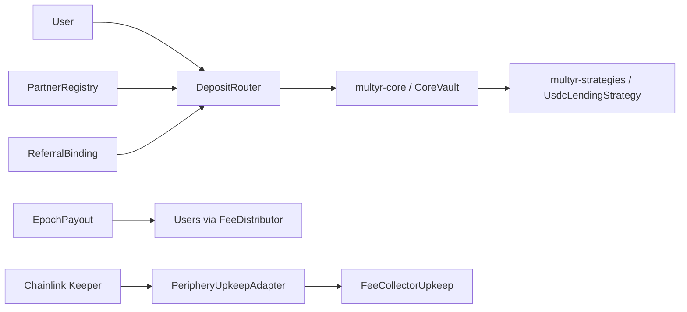

# multyr-periphery

> Periphery contracts for Multyr Protocol — rewards distribution, deposit routing,
> automation, and ops.

[](LICENSE)
[](https://getfoundry.sh)
[](https://github.com/Multyr/multyr-periphery/actions)

---

## Overview

`multyr-periphery` contains the ecosystem contracts that surround `multyr-core`. These
contracts are not required for the vault's deposit/withdraw/rebalance cycle, but they
extend the protocol with incentive distribution, permissioned deposit routing, partner
and referral tracking, and automated operational maintenance.

The periphery layer is architecturally independent of the strategy layer: it holds no
imports from `multyr-strategies` and is not required for strategy execution. This
separation is intentional — it mirrors the `euler-vault-kit` / `evk-periphery` model
and allows periphery contracts to be audited and upgraded without touching core or
strategy scopes.

All periphery contracts interact with `multyr-core` exclusively via its published
Solidity interfaces (`@multyr-core/interfaces/`). The core vault itself has no
compile-time dependency on any periphery contract.

Subgraph indexing for all on-chain events lives in a separate repository
(`Multyr/subgraphs`).

---

## Architecture



Periphery modules are independently deployable. Each module registers against the core
vault via its interface and does not call other periphery modules directly. The sole
shared dependency is `@multyr-core/interfaces/`.

---

## Key Concepts & Invariants

- **Epoch finality**: once `EpochPayout` finalizes an epoch, the per-user reward shares
  are immutable. No governance action can redistribute a finalized epoch's reward pool.
- **Referral write-once**: `ReferralBinding` records referral attribution once per user
  address. Reassignment is blocked at the contract level; no admin override exists.
- **Deposit router optional**: the core vault accepts direct deposits from any address.
  `DepositRouter` adds a permissioned whitelist layer on top; disabling or replacing the
  router does not affect the core vault's deposit function.
- **Partner fee split at entry**: partner fee attribution is computed and locked at deposit
  time by `DepositRouter`. Post-deposit redistribution of partner credits is not possible.
- **No cross-periphery calls**: periphery modules do not call each other. The shared
  dependency surface is limited to `@multyr-core/interfaces/` — no periphery module
  imports another periphery module.
- **Independent upgradeability**: periphery contracts are independently deployable and
  upgradeable without any governance action on `multyr-core`. A new `DepositRouter` can
  be pointed at the same vault without touching core state.
- **Upkeep composability**: `PeripheryUpkeepAdapter` wraps multiple upkeep jobs under a
  single Chainlink Automation registration. Removing or replacing an individual job does
  not affect the adapter's registration or the core keeper registration.

See [`docs/architecture.md`](docs/architecture.md) for the complete invariant set and
cross-repo wiring diagram.

---

## Modules

| Contract | Source folder | Purpose |
|---|---|---|
| `EpochPayout` | `src/rewards/` | Epoch reward settlement — computes per-user share from reward pool snapshots |
| `FeeDistributor` | `src/rewards/` | Fee-token distribution to eligible recipients after epoch finalization |
| `DepositRouter` | `src/router/` | Permissioned deposit entry point — whitelist, referral attribution, partner routing |
| `PartnerRegistry` | `src/partner/` | Partner address registry with fee-split configuration, timelocked governance |
| `ReferralBinding` | `src/referral/` | On-chain referral tracking — write-once per user, epoch-based reward credits |
| `FeeCollectorUpkeep` | `src/upkeep/` | Chainlink Automation keeper — periodic fee harvest from vault to treasury |
| `OpsCollector` | `src/upkeep/` | Operational fee aggregation from multiple sources |
| `PeripheryUpkeepAdapter` | `src/upkeep/` | Unified `checkUpkeep`/`performUpkeep` wrapper for multiple periphery jobs |

---

## Repo Layout

```
multyr-periphery/
|- src/
|   |- rewards/        EpochPayout, FeeDistributor
|   |- router/         DepositRouter
|   |- partner/        PartnerRegistry
|   |- referral/       ReferralBinding
|   \- upkeep/         FeeCollectorUpkeep, OpsCollector, PeripheryUpkeepAdapter
|- lib/
|   \- multyr-core/    GitHub submodule (read-only reference)
|- docs/               Architecture, wiring diagram, audit scope
|- audits/             Signed external audit PDFs (empty until first published audit)
|- SECURITY.md
|- CONTRIBUTING.md
\- LICENSE
```

---

## Cross-Repo Dependencies

`multyr-periphery` depends on `multyr-core` for shared Solidity interfaces only.

| Dependency | Type | Import alias | Purpose |
|---|---|---|---|
| `multyr-core` | GitHub submodule | `@multyr-core/` | `IVault`, `IStrategyRouter`, `IWarmAdapter`, and other shared interfaces |

No dependency exists between `multyr-periphery` and `multyr-strategies`. Periphery
contracts address the UX and incentive layer; they have no knowledge of strategy
internals.

Remapping used in `foundry.toml`:
```
@multyr-core/=lib/multyr-core/src/
```

During local development (pre-UPLOAD), `lib/multyr-core/` is a relative symlink to the
local checkout. After `UPLOAD-CORE`, it becomes a pinned GitHub submodule.

---

## Documentation

| Document | Location | Content |
|---|---|---|
| Architecture overview | `docs/architecture.md` | Module graph, event flows, cross-repo wiring |
| Module interface tables | `docs/modules.md` | Per-contract function signatures and access roles |
| Audit scope | `docs/audit-scope.md` | In-scope files, known findings, audit perimeter |
| Access control | `docs/access-control.md` | Role matrix, timelock configuration |

---

## Audits

No external audits have been completed yet. Pre-audit hardening is in progress. When
third-party security audits are published, the signed PDF reports will appear in
[`audits/`](audits/).

For internal security work — hardening reports, automated tool outputs, self-reviews —
see the `multyr-research` repository (private, available to qualified reviewers on request).
Internal reports are not a substitute for third-party security review.

| Date | Auditor | Scope | Findings | Report |
|---|---|---|---|---|
| Planned 2026-Q3 | TBD | `multyr-periphery` v1.0 | — | — |

---

## Security

To report a vulnerability, email **security@multyr.fi** or see [`SECURITY.md`](SECURITY.md)
for the full responsible disclosure process, severity classification (CVSS v3.1), and
response timeline.

Acknowledged within 48 hours. Critical findings triaged within 72 hours.
Do not open public GitHub issues for security vulnerabilities.

Bug bounty program: forthcoming (Immunefi — link to be published after first signed
audit report).

---

## Build and Test

### Prerequisites

- [Foundry](https://book.getfoundry.sh/) `forge` >= 0.2.0
- Git with submodule support

### Setup

```bash
git clone --recurse-submodules https://github.com/Multyr/multyr-periphery
cd multyr-periphery
forge install
```

### Build

```bash
forge build
```

### Test

```bash
# Unit and integration tests (no RPC required)
forge test

# Fork tests against Arbitrum (requires ARBITRUM_ARCHIVE_RPC_URL)
ARBITRUM_ARCHIVE_RPC_URL=<rpc> forge test --match-path "test/fork/**"
```

---

## Deployment

Periphery contracts are deployed after `multyr-core` and before the first user-facing
launch. The deployment sequence is managed in `multyr-deployment` (private).

Deployments are tracked in `multyr-deployment/broadcast/` (private). No deployment
artifacts are committed to this repository.

| Network | Status |
|---|---|
| Arbitrum One | Pending first external audit |

---

## Governance

Periphery parameters (epoch duration, partner fee splits, whitelist entries) are
governed by the Multyr Foundation timelocked multisig. The timelock address is set at
construction and cannot be changed without redeployment.

Periphery contracts are independently upgradeable — a new `DepositRouter` can be deployed
and pointed at the same `multyr-core` vault without governance action on the vault itself.

| Role | Capabilities |
|---|---|
| Timelock multisig (owner) | Add/remove partners, configure epoch duration, update whitelist |
| Guardian | Emergency pause of individual upkeep jobs |
| Deployer (renounced) | Initial bootstrap only; no role retained post-deploy |

---

## License

The periphery contracts are licensed under the **Business Source License 1.1** with an
automatic conversion to GPL-2.0-or-later four years after the protocol's mainnet launch
date. See [`LICENSE`](LICENSE) for full terms.

The Solidity interfaces in `src/interfaces/` are additionally available under the **MIT
License** — see [`src/interfaces/LICENSE-INTERFACES`](src/interfaces/LICENSE-INTERFACES).

---

## Contributing

See [`CONTRIBUTING.md`](CONTRIBUTING.md) for development conventions, branch policy, and
the PR review process.

---

## Links

- Protocol: [multyr.fi](https://multyr.fi)
- Core protocol: [Multyr/multyr-core](https://github.com/Multyr/multyr-core)
- Strategies: [Multyr/multyr-strategies](https://github.com/Multyr/multyr-strategies)
- Subgraphs: [Multyr/subgraphs](https://github.com/Multyr/subgraphs)
- Security contact: security@multyr.fi
