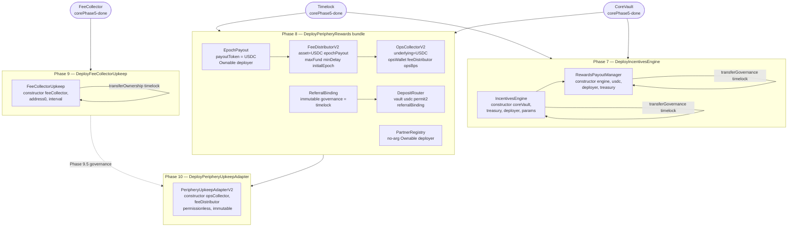

# multyr-periphery — Deployment Guide

> **Audience**: deployer / auditor
> **Chain**: Arbitrum One (chainId 42161 — enforced at runtime in every script)
> **Source**: 7 deploy scripts in `multyr-periphery/script/`

---

## 1. Deploy Phase Map

Periphery contracts deploy across 4 phases. Each phase depends on the previous one.

| Phase | Script | Contracts deployed | Depends on |
|---|---|---|---|
| 7 | `DeployIncentivesEngine.s.sol` | IncentivesEngine, RewardsPayoutManager | CoreVault + Timelock (core Phase 5) |
| 8 | `DeployPeripheryRewards.s.sol` | ReferralBinding, PartnerRegistry, EpochPayout, FeeDistributorV2, OpsCollectorV2, DepositRouter | Phase 7 complete |
| 9 | `DeployFeeCollectorUpkeep.s.sol` | FeeCollectorUpkeep | FeeCollector (core), CoreVault share token |
| 10 | `DeployPeripheryUpkeepAdapter.s.sol` | PeripheryUpkeepAdapterV2 | Phase 8 + 9.5 governance actions complete |

**Standalone / incident-response scripts** (safe to run independently):

| Script | Contract | Safe to redeploy |
|---|---|---|
| `DeployEpochPayout.s.sol` | EpochPayout | Yes — requires governance wiring post-deploy |
| `DeployPermit2DepositHelper.s.sol` | Permit2DepositHelper | Yes — stateless, immutable |

---

## 2. Deploy Flow Diagram

---

## 3. Phase 7 — IncentivesEngine + RewardsPayoutManager

**Script**: `script/DeployIncentivesEngine.s.sol:23`

### Environment variables

| Var | Required | Description |
|---|---|---|
| `CORE_VAULT` | yes | CoreVault address (from core phase 5) |
| `TIMELOCK` | yes | Multyr timelock (governance) |
| `TREASURY` | yes | Treasury address (USDC source for rewards) |
| `USDC` | yes | `0xaf88d065e77c8cC2239327C5EDb3A432268e5831` on Arbitrum |
| `DEPLOYER_PK` | yes | Private key of deployer EOA |

### Deploy sequence

1. Deploy `IncentivesEngine(coreVault, treasury, deployer, params)` — `DeployIncentivesEngine.s.sol:63`
   - Default params: `cliffDays=30, fullDays=180, vestingDays=180, bmaxWad=3e16, mode=VaultShares, active=true`
2. Deploy `RewardsPayoutManager(engine, usdc, deployer, treasury)` — `DeployIncentivesEngine.s.sol:75`
3. `payout.setSharesMintAuthority(coreVault)` — `DeployIncentivesEngine.s.sol:87`
4. `engine.transferGovernance(timelock)` — `DeployIncentivesEngine.s.sol:94`
5. `payout.transferGovernance(timelock)` — `DeployIncentivesEngine.s.sol:97`
6. Sanity check: `IRewardsPayoutManager(payout).governance() == timelock` — `DeployIncentivesEngine.s.sol:101`

### Post-deploy (via timelock)

1. `AdminModule.setIncentivesEngine(<engine>)` — `DeployIncentivesEngine.s.sol:114`
2. `AdminModule.setRewardsPayoutManager(<payout>)` — `DeployIncentivesEngine.s.sol:115`
3. Treasury: `USDC.approve(<rewardsPayoutManager>, type(uint256).max)` — `DeployIncentivesEngine.s.sol:116`

---

## 4. Phase 8 — Periphery Rewards Bundle (6 contracts)

**Script**: `script/DeployPeripheryRewards.s.sol:44`

Deploys all 6 periphery reward contracts in strict dependency order. Ownership transfers happen in Phase 9.5 (NOT in this script). — `DeployPeripheryRewards.s.sol:22`

### Environment variables

| Var | Required | Default | Description |
|---|---|---|---|
| `DEPLOYER_PRIVATE_KEY` | yes | — | Deployer EOA private key |
| `VAULT_ADDRESS` | yes | — | CoreVault address |
| `TIMELOCK_ADDRESS` | yes | — | Multyr timelock |
| `OPS_WALLET_ADDRESS` | yes | — | Ops wallet (receives ops fees) |
| `PERMIT2_ADDRESS` | no | `0x000000000022D473030F116dDEE9F6B43aC78BA3` | Uniswap Permit2 canonical |
| `USDC_ADDRESS` | no | `0xaf88d065e77c8cC2239327C5EDb3A432268e5831` | USDC on Arbitrum |
| `OPS_BPS` | no | `5000` (50%) | Ops fee split basis points |
| `MAX_FUND_PER_EPOCH` | no | `50000e6` (50k USDC) | FeeDistributorV2 max fund per epoch |
| `MIN_DELAY_BETWEEN_FUNDS` | no | `86400` (1 day) | FeeDistributorV2 min delay |
| `INITIAL_EPOCH_ID` | no | `1` | FeeDistributorV2 initial epoch |

### Deploy sequence

1. `new ReferralBinding(timelock)` — immutable governance — `DeployPeripheryRewards.s.sol:110`
2. `new PartnerRegistry()` — no-arg, `Ownable(deployer)` — `DeployPeripheryRewards.s.sol:117`
3. `new EpochPayout(usdc)` — `Ownable(deployer)` — `DeployPeripheryRewards.s.sol:124`
4. `new FeeDistributorV2(usdc, epochPayout, maxFund, minDelay, initialEpoch)` — `Ownable(deployer)` — `DeployPeripheryRewards.s.sol:133`
5. `new OpsCollectorV2(usdc, opsWallet, feeDistributor, opsBps)` — `Ownable(deployer)` — `DeployPeripheryRewards.s.sol:148`
   - NOTE: vault share tokens added via `addVault()` in Phase 9.5, not in constructor — `DeployPeripheryRewards.s.sol:146`
6. `new DepositRouter(vault, usdc, permit2, referralBinding)` — `DeployPeripheryRewards.s.sol:161`

### Phase 9.5 — Post-deploy governance actions (via timelock)

Required before Phase 10. — `DeployPeripheryRewards.s.sol:34`

1. `OpsCollectorV2.transferOwnership(timelock)` — `DeployPeripheryRewards.s.sol:175`
2. `FeeDistributorV2.transferOwnership(timelock)` — `DeployPeripheryRewards.s.sol:176`
3. `EpochPayout.transferOwnership(timelock)` — `DeployPeripheryRewards.s.sol:177`
4. `PartnerRegistry.transferOwnership(timelock)` — `DeployPeripheryRewards.s.sol:178`
5. `ReferralBinding.setRouter(depositRouter, true)` — `DeployPeripheryRewards.s.sol:179`
6. `FeeCollector.setParams(treasury, opsCollector, safetyReserve, treasuryBps, safetyBps)` — `DeployPeripheryRewards.s.sol:180`
7. `OpsCollectorV2.addVault(coreVault)` — registers vault share token — `DeployPeripheryRewards.s.sol:181`

---

## 5. Phase 9 — FeeCollectorUpkeep

**Script**: `script/DeployFeeCollectorUpkeep.s.sol:21`

**CRITICAL order invariant** (v9 mainnet incident 2026-04-06): `addToken(vault)` MUST be called BEFORE `transferOwnership(timelock)`. If ownership is transferred first, `addToken` requires a timelock proposal — fees will not distribute until the next governance cycle. — `DeployFeeCollectorUpkeep.s.sol:12`

### Environment variables

| Var | Required | Description |
|---|---|---|
| `FEE_COLLECTOR_ADDRESS` | yes | FeeCollector (from core Phase 5) |
| `VAULT_ADDRESS` | yes | CoreVault address (registered as share token) |
| `DISTRIBUTE_INTERVAL` | yes | Upkeep interval in seconds (259200 = 3 days) |
| `TIMELOCK_ADDRESS` | yes | Multyr timelock (receives ownership) |

### Deploy sequence

1. `new FeeCollectorUpkeep(feeCollector, address(0), interval)` — `DeployFeeCollectorUpkeep.s.sol:50`
   - `address(0)` as second arg (reserved slot, not used) — `DeployFeeCollectorUpkeep.s.sol:50`
2. `upkeep.addToken(vault)` — registers vault share token BEFORE ownership transfer — `DeployFeeCollectorUpkeep.s.sol:54`
3. `upkeep.transferOwnership(timelock)` — `DeployFeeCollectorUpkeep.s.sol:58`

### Post-deploy

1. Register `FeeCollectorUpkeep` on Chainlink Automation Network — `DeployFeeCollectorUpkeep.s.sol:69`
2. Verify: `cast call <upkeep> "checkUpkeep(bytes)(bool,bytes)" 0x` — `DeployFeeCollectorUpkeep.s.sol:70`

---

## 6. Phase 10 — PeripheryUpkeepAdapterV2

**Script**: `script/DeployPeripheryUpkeepAdapter.s.sol:23`

Permissionless, stateless (immutables only), no owner or roles. — `DeployPeripheryUpkeepAdapter.s.sol:14`

**Prerequisite**: Phase 8 + 9.5 governance actions complete.

### Environment variables

| Var | Required | Description |
|---|---|---|
| `DEPLOYER_PRIVATE_KEY` | yes | Deployer EOA private key |
| `OPS_COLLECTOR_ADDRESS` | yes | OpsCollectorV2 (from Phase 8) |
| `FEE_DISTRIBUTOR_ADDRESS` | yes | FeeDistributorV2 (from Phase 8) |

### Deploy sequence

1. `new PeripheryUpkeepAdapterV2(opsCollector, feeDistributor)` — `DeployPeripheryUpkeepAdapter.s.sol:53`
   - Pipeline: `OpsCollectorV2.splitAll()` → `FeeDistributorV2.fundEpochPayout()` (deterministic priority: SPLIT > FUND) — `DeployPeripheryUpkeepAdapter.s.sol:12`

### Post-deploy

1. Register `PeripheryUpkeepAdapterV2` on Chainlink Automation Network — `DeployPeripheryUpkeepAdapter.s.sol:60`
2. Fund upkeep with LINK — `DeployPeripheryUpkeepAdapter.s.sol:61`
3. Verify: `cast call <adapter> "checkUpkeep(bytes)(bool,bytes)" 0x` — `DeployPeripheryUpkeepAdapter.s.sol:62`

---

## 7. Standalone / Incident Response Scripts

### 7a. DeployEpochPayout (standalone redeploy)

**Script**: `script/DeployEpochPayout.s.sol:26`

Use when `EpochPayout` must be replaced without redeploying the full Phase 8 bundle. — `DeployEpochPayout.s.sol:10`

**Warning**: all existing epoch Merkle roots are lost on redeploy — notify off-chain indexer. — `DeployEpochPayout.s.sol:16`

| Var | Required | Default | Description |
|---|---|---|---|
| `DEPLOYER_PRIVATE_KEY` | yes | — | Deployer EOA |
| `USDC_ADDRESS` | no | `0xaf88d065e77c8cC2239327C5EDb3A432268e5831` | USDC on Arbitrum |
| `TIMELOCK_ADDRESS` | no | `address(0)` | If set, ownership transferred atomically at deploy |

**Deploy**: `new EpochPayout(usdc)` — `DeployEpochPayout.s.sol:62`

**Post-deploy** (via governance): — `DeployEpochPayout.s.sol:21`
1. `FeeDistributorV2.setEpochPayout(<newEpochPayout>)`
2. `EpochPayout.transferOwnership(timelock)` (if `TIMELOCK_ADDRESS` not set at deploy)
3. Notify off-chain indexer of new `EpochPayout` address

### 7b. DeployPermit2DepositHelper

**Script**: `script/DeployPermit2DepositHelper.s.sol:20`

Stateless and immutable — no owner, no roles. Safe to redeploy at any time. — `DeployPermit2DepositHelper.s.sol:14`

| Var | Required | Default | Description |
|---|---|---|---|
| `DEPLOYER_PRIVATE_KEY` | yes | — | Deployer EOA |
| `VAULT_ADDRESS` | yes | — | CoreVault address |
| `USDC_ADDRESS` | no | `0xaf88d065e77c8cC2239327C5EDb3A432268e5831` | USDC on Arbitrum |

**Deploy**: `new Permit2DepositHelper(PERMIT2, vault, usdc)` — `DeployPermit2DepositHelper.s.sol:55`
- Canonical Permit2: `0x000000000022D473030F116dDEE9F6B43aC78BA3` — `DeployPermit2DepositHelper.s.sol:25`
- Verifies `vault.asset() == usdc` at deploy time (reverts on mismatch) — `DeployPermit2DepositHelper.s.sol:14`

**Post-deploy**: No wiring required. Update frontend/SDK `permit2Helper` address. — `DeployPermit2DepositHelper.s.sol:61`

---

## 8. Canonical Addresses (Arbitrum One)

| Token / Protocol | Address |
|---|---|
| USDC (native) | `0xaf88d065e77c8cC2239327C5EDb3A432268e5831` |
| Uniswap Permit2 | `0x000000000022D473030F116dDEE9F6B43aC78BA3` |

Sources: `DeployPeripheryRewards.s.sol:49`, `DeployPermit2DepositHelper.s.sol:25`

---

## 9. Security Notes

1. **FeeCollectorUpkeep order invariant** — `addToken` before `transferOwnership` is enforced atomically in `DeployFeeCollectorUpkeep.s.sol` — `DeployFeeCollectorUpkeep.s.sol:12`. Violation caused v9 mainnet incident (2026-04-06): fees failed to distribute for an entire governance cycle.

2. **Phase 9.5 required before Phase 10** — `PeripheryUpkeepAdapterV2` (`checkUpkeep`) triggers `OpsCollectorV2.splitAll()`. If `addVault()` has not been called on `OpsCollectorV2`, `splitAll()` is a no-op and LINK is burned on useless performUpkeep calls. — `DeployPeripheryRewards.s.sol:41`

3. **Ownable2Step throughout** — all four Ownable contracts (EpochPayout, FeeDistributorV2, OpsCollectorV2, PartnerRegistry) use Ownable2Step. Pending owner must call `acceptOwnership()` after timelock proposes transfer. — `DeployPeripheryRewards.s.sol:35`

4. **Chain ID guard** — every script reverts on non-Arbitrum chains with `"WRONG_CHAIN"`. — `DeployIncentivesEngine.s.sol:28`, `DeployPeripheryRewards.s.sol:68`, `DeployFeeCollectorUpkeep.s.sol:26`, `DeployPeripheryUpkeepAdapter.s.sol:28`

5. **IncentivesEngine governance** — deployer is initial governance for IncentivesEngine and RewardsPayoutManager; both are transferred to timelock within the same broadcast (`DeployIncentivesEngine.s.sol:94,97`). Post-deploy timelock wiring (`AdminModule.setIncentivesEngine`, `setRewardsPayoutManager`) is required before any rewards accrue.
